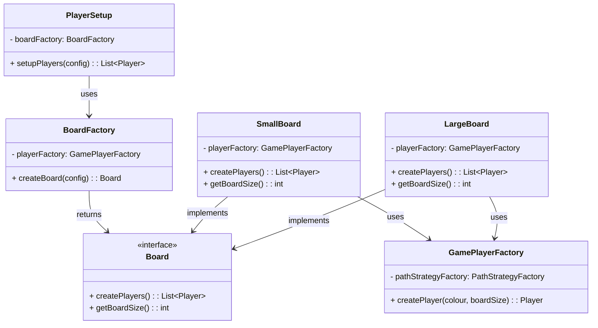

# Software Design and Architecture ReadMe

## Table of Contents
- Overview
- Variations implemented
- Other design patterns and their implementations
- Clean architecture
- Evaluation

## Overview
This document provides an overview of the creation of a turn-based board game 
based on the popular board game "frustration". The system has incorporated a number of key
software design and architecture principles to ensure extensibility and flexibility.
In this document I will explore the key concepts, their architecture and the design
choices that were made to ultimately form the system. This readme documentation assumes a
prior understanding of software design and architecture principles.

## Variations implemented
_**Functional Variations**_
<br>All the defined functional variations have been implemented as part of this system.
This includes a _Single Die_ variation, a rule defining that a player must land on their
_Exact END Position_ to win and, a rule defining that a player must stay in place upon _hitting another player_. 

**Single Die Variation**
<br>To Achieve this variation, where a player can select a single die instead of two dice, the system is designed
to run with either a single die, two dice or a fixed set of rolls upon the game setup.

This variation was achieved by using the **factory pattern** alongside the **strategy pattern**. The dice-rolling behavior is encapsulated in the `DiceShaker` interface.
The interface provides the abstract method for all the dice rolls within the system. Concrete implementations of this interface 
then define how the roll values are produced, they can be injected at runtime without affecting the core game logic.
```java
public interface DiceShaker {
    int shake();
}
```

- `RandomSingleDiceShaker` generates a single random value between 1 and 6.
- `RandomTwoDiceShaker` consists of two `DiceShaker` instances and returns the sum of the results. (.i.e between 2-12)
- `FixedDiceShaker` returns a predefined sequence of values. This allows deterministic replays and the ability to test scenarios.

The concrete implementation which is configured for the game is handled by the `DefaultDiceShakerFactory`. Which is dependent only on the `GameConfig`
value object and decides the `DiceShaker` implementation to provide based on the game configuration. This decision logic helps it to remain extensible and clean.
```java
public class DefaultDiceShakerFactory implements DiceShakerFactory {
    @Override
    public DiceShaker create(GameConfig config) {
        if (config.getFixedRolls() != null) {
            return new FixedDiceShaker(config.getFixedRolls());
        } else if (config.isTwoDice()) {
            return new RandomTwoDiceShaker(new RandomSingleDiceShaker(), new RandomSingleDiceShaker());
        } else {
            return new RandomSingleDiceShaker();
        }
    }
}
```
The design  adheres to the following SOLID principles -
- **Open/Closed Principle (OCP)** - Changes to dice strategies including introducing new strategies can be added by introducing new
`DiceShaker` implementations without modifying existing game logic. 
- **Dependency Inversion Principal (DIP)** - Core game components depend on the `DiceShaker` abstraction as opposed to the concrete
implementations.
- **Single Responsibility Principle(SRP)** - Each dice shaker class is responsible only for generating roll values.

**Exact Landing on End Position Variation**
<br>This variation enforces the player to land exactly on their final (end) position in order to win. A roll taking the player past the end is known
as an _overshoot_ and would cause the player to forfeit their turn. The system supports allowing an overshoot taking the player directly to the end,
or enforcing the player rolls the exact number to land on the end.

The variation is implemented via the **Strategy Pattern**. A **factory pattern** is used to select the appropriate strategy at game setup.
Overshooting behaviour is encapsulated in an interface called `OvershootingStrategy`, this provides a common contract for determining whether a move is allowed
and whether it would overshoot the end.
```java
public interface OvershootingStrategy {
    boolean isMoveAllowed(Player player, int steps);
    boolean wouldOvershoot(Player player, int steps);
}
```
There are only two concrete implementations of this interface. `NoOvershootingStrategy` and `OvershootingAllowed`. The selection of the implementation
is decided by the `OvershootingFactory` which depends only on the `GameConfig` value object and allows the rule to be configured at runtime without
modifying core game logic.
```java
public class OvershootingFactory implements OvershootingHelper {
    @Override
    public OvershootingStrategy create(GameConfig config) {
        if (config.isOvershootingAllowed()) {
            return new OvershootingAllowed();
        } else {
            return new NoOvershootingStrategy();
        }
    }
}
```
The design  adheres to the following SOLID principles -
- **Open/Closed Principle (OCP)** - New rules can be introduced by adding new strategy implementations without modifying existing game logic.
- **Dependency Inversion Principal (DIP)** - Core game components depend on the `OvershootingStrategy` abstraction as opposed to the concrete
  implementations.
- **Single Responsibility Principle(SRP)** - Each strategy class is responsible only for evaluating if the move is valid or not dependent on the given rules.

**Player stays where they are if they hit another player**
<br> This variation enforces a rule that if a player were to move were another player is currently occupying that position.
The rolling player would remain in situ and forfeit their turn. The method of implementation of this variation shares many 
similarities with the Overshooting rule.

Behaviour is implemented using the **Strategy Pattern**. The `HitRuleStrategy` interfaces defines the contract for determining hit occurrences
and how they're handled.
```java
public interface HitRuleStrategy {
    Player getPlayerHit(Player player, List<Player> allPlayers, String intendedPosition);
    boolean hitsAllowed();
    }
```
Two concrete strategies implement the interface. `HitsAllowedStrategy` allow hits. `HitsProhibitedStrategy` disallows hits, causing the player to forfeit their turn.
The strategy is selected at runtime by the `HitRuleFactory` which is dependent on `GameConfig`
```java
public class HitRuleFactory implements HitRuleHelper {
    @Override
    public HitRuleStrategy create(GameConfig config) {
        if (config.isHitsAllowed()) {
            return new HitsAllowedStrategy();
        } else {
            return new HitsProhibitedStrategy();
        }
    }
}
```
The design  adheres to the following SOLID principles -
- **Open/Closed Principle (OCP)** - New hit behaviours can be introduced by adding new strategy implementations without modifying existing game logic.
- **Dependency Inversion Principal (DIP)** - Core game components depend on the `HitRuleStrategy` abstraction as opposed to the concrete
  implementations.
- **Single Responsibility Principle(SRP)** - Each strategy class is responsible only for evaluating if the move is valid or not dependent on the given rules.

_**Advanced Features**_

**Large Board with 4 Players**
<br> This variation is to allow a large board with 4 players, which is 36 positions on the main board and 6 tail positions (inclusive of the end position).
The normal game only has 2 players, with 18 positions on the main board with 3 tail positions. 

The board is represented by the `Board` interface with two concrete implementations `SmallBoard` and `LargeBoard`.
```java
public interface Board {
    List<Player> createPlayers();
    int getBoardSize();
}
```
This encapsulated board size and player creation. Players are then created using `GamePlayerFactory` which generates a path according to the boardsize. 
This makes use of the `Position` value object.

```java
public class Position {
    private final String name;
    public Position(String name) {
        this.name = name;
    }
    @Override
    public String toString() {
        return name;
    }
}
```
The `BoardFactory` chooses the appropriate board at runtime based on the `GameConfig`.
```Java
public class BoardFactory {
    private final GamePlayerFactory playerFactory;
    public BoardFactory(GamePlayerFactory playerFactory) {
        this.playerFactory = playerFactory;
    }
    public Board createBoard(GameConfig config){
        if (config.isLargeBoard()) {
            return new LargeBoard(playerFactory);
        } else {
            return new SmallBoard(playerFactory);
        }
    }
}
```
The `GamePlayerFactory` creates `Player` objects with a path corresponding to the board size. Exhibiting the factory pattern.
```Java
    public Player createPlayer(PlayerColour colour, int boardSize) {
        PathStrategy strategy = strategyFactory.createPathStrategy(colour);
        return new Player(colour, strategy.createPath(boardSize));
    }
```
_How is this used in the Game Setup?_ The `PlayerSetup` class now delegates the board selection and player creation to the `Board` abstraction.
```Java
    public List<Player> setupPlayers(GameConfig config) {
    Board board = boardFactory.createBoard(config);
    return board.createPlayers();
}
```
I had previously implemented `PlayerSetup` with conditional logic, returning players based on the boardSize.
Implementing the `BoardFactory` in a factory pattern has allowed me to create _Boards_ dynamically based on the `GameConfig`




## Other design patterns and their implementations

## Clean architecture

## Evaluation 
